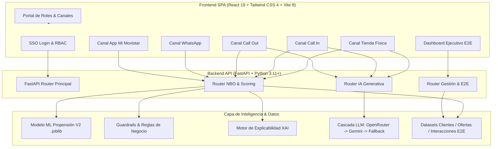

# 🚀 Movi Nexo (NBO 2.0) — Sistema Omnicanal de Recomendación Inteligente

> **Solución Integral de Inteligencia Artificial para Personalización Comercial, Recomendación Next Best Offer (NBO), Explicabilidad (XAI), IA Generativa y Trazabilidad End-to-End (E2E) para Movistar Perú.**

La conexión ejecutable entre datos, modelo, motor, API y frontend se documenta
en [`docs/integracion_motor_frontend.md`](docs/integracion_motor_frontend.md).

**Demo desplegada:** [movinexo.vercel.app](https://movinexo.vercel.app)

---

## 📋 Índice
1. [Descripción General](#-descripción-general)
2. [Arquitectura del Sistema](#-arquitectura-del-sistema)
3. [Stack Tecnológico y Versiones](#-stack-tecnológico-y-versiones)
4. [Estructura del Proyecto](#-estructura-del-proyecto)
5. [Módulos y Funcionalidades Desarrolladas](#-módulos-y-funcionalidades-desarrolladas)
   - [1. Backend & API REST (FastAPI)](#1-backend--api-rest-fastapi)
   - [2. Motor de Inferencia NBO & Reglas de Negocio](#2-motor-de-inferencia-nbo--reglas-de-negocio)
   - [3. Servicio de IA Generativa Multi-Proveedor (Cascada)](#3-servicio-de-ia-generativa-multi-proveedor-cascada)
   - [4. Trazabilidad E2E y Métricas en Tiempo Real](#4-trazabilidad-e2e-y-métricas-en-tiempo-real)
   - [5. Frontend React & Sistema de Diseño Omnicanal](#5-frontend-react--sistema-de-diseño-omnicanal)
6. [Canales Adaptativos Implementados](#-canales-adaptativos-implementados)
7. [Guía de Instalación y Despliegue Local](#-guía-de-instalación-y-despliegue-local)
8. [Variables de Entorno (.env)](#-variables-de-entorno-env)
9. [Impacto en el Negocio & KPIs](#-impacto-en-el-negocio--kpis)

---

## 🌟 Descripción General

El sistema **Movi Nexo** es una plataforma tecnológica desarrollada para transformar la personalización comercial en Movistar Perú. Integra modelos predictivos de Machine Learning, reglas de negocio avanzadas, Explainable AI (XAI), Inteligencia Artificial Generativa y un frontend responsivo multicanal.

### Objetivos Clave Alcanzados:
- **Priorización Estratégica de Movistar Total (MT):** Detección inteligente de clientes elegibles para convergencia fijo + móvil con hasta 50% de ahorro.
- **Omnicanalidad Real:** Interfaces personalizadas para 5 canales de atención (Tienda Física, Call In, Call Out, WhatsApp y App Digital).
- **Argumentación Comercial Dinámica:** Generación de discursos comerciales (*pitch*) y contra-argumentación de objeciones (*rebate*) asistidos por LLMs (Google Gemini / OpenRouter / Fallback Offline).
- **Trazabilidad E2E Cerrada:** Registro en tiempo real de cada interacción comercial, midiendo conversión, rechazos y funnel completo.

---

## 🏗️ Arquitectura del Sistema



---

## 💻 Stack Tecnológico y Versiones

### Backend (Python & Machine Learning)
| Tecnología | Versión | Propósito |
|---|---|---|
| **Python** | `3.11+` | Lenguaje de programación principal del backend |
| **FastAPI** | `^0.115.0` | Framework web asíncrono de alto rendimiento para APIs RESTful |
| **Uvicorn** | `^0.34.0` | Servidor ASGI para producción y desarrollo |
| **Pydantic** | `^2.10.0` | Validación y serialización estricta de esquemas de datos |
| **Scikit-Learn** | `^1.4.0` | Inferencia del pipeline del modelo supervisado de propensión |
| **Joblib** | `^1.4.0` | Carga e instanciación del artefacto del modelo entrenado (`.joblib`) |
| **Pandas** | `^2.2.0` | Transformación, filtrado y vectorización de datos tabulares |
| **NumPy** | `^1.26.0` | Operaciones matemáticas y manipulación de matrices |
| **Google Generative AI** | `^0.8.0` | SDK oficial para invocación de modelos Google Gemini |
| **Requests** | `^2.31.0` | Cliente HTTP para integración con API OpenRouter |
| **Python-Dotenv** | `^1.0.1` | Carga segura de variables de entorno desde `.env` |

### Frontend (SPA & UI/UX)
| Tecnología | Versión | Propósito |
|---|---|---|
| **React** | `19.2.8` | Biblioteca base para interfaces de usuario reactivas |
| **React DOM** | `19.2.8` | Renderizado del DOM para React 19 |
| **Vite** | `8.2.2` | Entorno de desarrollo ultrarrápido y empaquetador de producción |
| **Tailwind CSS** | `4.3.3` | Motor de estilos basado en utilidades de última generación |
| **@tailwindcss/vite** | `4.3.3` | Integración nativa de Tailwind CSS 4 con Vite |
| **Recharts** | `3.10.1` | Biblioteca de gráficos SVG para métricas y funnels E2E |
| **Lucide React** | `1.33.0` | Set iconográfico empresarial y minimalista |
| **Clsx** | `2.1.1` | Utilidad para composición dinámica de clases CSS condicionales |
| **Oxlint** | `1.79.0` | Linter de código JavaScript/React de alto rendimiento |

---

## 📁 Estructura del Proyecto

```
Sistema propuesto/
├── .env.example                         # Plantilla de variables de entorno sin secretos
├── .gitignore                           # Exclusión de credenciales, venv y node_modules
├── requirements.txt                     # Dependencias oficiales de Python
├── Logo.svg                             # Isotipo corporativo oficial
├── guia_desafio_NBO_movistar.md         # Ficha técnica y requerimientos del desafío
├── README.md                            # Documentación técnica integral del sistema
│
├── backend/                             # Módulo de Servidor y Lógica de Negocio (FastAPI)
│   ├── __init__.py                      # Módulo Python
│   ├── main.py                          # Entrada de la API FastAPI, CORS y endpoints raíz
│   ├── nbo_router.py                    # Orquestador NBO, scoring al vuelo y reglas de negocio
│   ├── dashboard_router.py              # Endpoints de métricas E2E y registro de interacciones
│   ├── inferencia.py                    # Inferencia ML y generador de Explainable AI (XAI)
│   ├── inferencia_modelo.py             # Script de inferencia y scoring batch
│   ├── run_backend.bat                  # Script de inicio rápido en Windows
│   ├── Modelo/
│   │   └── modelo_propension_v2_candidato.joblib # Artefacto supervisado entrenado
│   ├── Motor/
│   │   ├── motor_oficial.py             # Motor oficial NBO de producción
│   │   └── motor_reglas_negocio.py      # Guardrails comerciales y reglas heurísticas
│   └── Legacy_AI/
│       ├── ai_service.py                # Servicio en cascada para IA Generativa (OpenRouter/Gemini/Offline)
│       └── ai_router.py                 # Endpoints REST para Pitch comercial y Rebates
│
├── data/                                # Capa de Almacenamiento y Datasets
│   ├── raw/catalogo_ofertas_entrega.csv # Catálogo maestro de ofertas comerciales
│   ├── processed/modelo_v2/             # Métricas de entrenamiento y evaluación de modelos
│   ├── interim/                         # Logs de auditoría e interacción local
│   ├── external/diccionario_datos_participantes.md # Diccionario de datos del reto
│   └── interacciones_e2e.csv            # Trazabilidad y persistencia de ventas/contactos
│
└── frontend_react/                      # Aplicación Cliente (React 19 + Tailwind CSS 4 + Vite 8)
    ├── package.json                     # Definición de scripts y dependencias
    ├── vite.config.js                   # Configuración del servidor Vite y plugins
    ├── index.html                       # Entry point HTML con tipografía corporativa
    ├── GUIA_DISENO_UX_UI.md             # Especificación del Design System Movistar
    ├── src/
    │   ├── main.jsx                     # Renderizado principal de la aplicación React
    │   ├── App.jsx                      # Orquestador de vistas, navegación y layout
    │   ├── index.css                    # Tokens de diseño, variables de color y directivas Tailwind
    │   ├── App.css                      # Animaciones personalizadas y micro-interacciones
    │   ├── context/
    │   │   └── ThemeContext.jsx         # Contexto global para Modo Oscuro / Claro
    │   ├── services/
    │   │   └── api.js                   # Capa de comunicación HTTP con Axios/Fetch al Backend
    │   ├── data/
    │   │   └── mockData.js              # Datos de respaldo para funcionamiento autónomo
    │   └── components/
    │       ├── CanalTienda.jsx          # Vista optimizada para atención presencial en Tienda
    │       ├── CanalCallIn.jsx          # Vista de retención y soporte entrante
    │       ├── CanalCallOut.jsx         # Vista de telemarketing y llamadas salientes
    │       ├── CanalWhatsApp.jsx        # Simulador de atención interactiva por WhatsApp
    │       ├── CanalDigital.jsx         # Simulador de auto-gestión App Mi Movistar / Web
    │       ├── DashboardE2E.jsx         # Tablero ejecutivo de control E2E y KPIs
    │       ├── RebateModal.jsx          # Modal interactivo con IA para rebatir objeciones
    │       ├── ThemeToggle.jsx          # Switch interactivo de modo Claro / Oscuro
    │       ├── auth/
    │       │   └── LoginSSO.jsx         # Pantalla de autenticación corporativa SSO
    │       └── portal/
    │           └── RolePortal.jsx       # Hub corporativo de selección de rol y canal
```

---

## ⚙️ Módulos y Funcionalidades Desarrolladas

### 1. Backend & API REST (FastAPI)
- **Controlador Principal (`main.py`):** Inicialización de la aplicación FastAPI v2.0.0, configuración de políticas CORS permissivas para integración frontend, inyección de dependencias (`DataLoader`, `NBORouter`, `PredictorNBO`) y modularización con `APIRouter`.
- **Endpoints de Clientes y Catálogo:**
  - `GET /api/clientes`: Listado paginado de clientes con scoring y recomendaciones NBO calculadas al vuelo.
  - `GET /api/clientes/{cliente_query}`: Búsqueda granular por `cliente_id`, DNI o índice.
  - `GET /api/ofertas`: Catálogo completo de ofertas vigentes (móvil, fibra, convergente).
  - `GET /api/model/status`: Estado del pipeline ML, latencia promedio (~3.8 ms) y características evaluadas.

### 2. Motor de Inferencia NBO & Reglas de Negocio
- **Scoring ML (`inferencia.py`):**
  - Carga del artefacto supervisado `modelo_propension_v2_candidato.joblib`.
  - Evaluación vectorial de 31 variables entre sociodemográficas, consumo y producto.
  - Explicabilidad del modelo (**XAI**): identificación de los 3 principales factores de decisión (consumo de datos, elegibilidad convergente, historial de pago, ahorro relativo).
- **Capa de Guardrails Comerciales (`nbo_router.py`):**
  1. *Regla Anti-Canibalización:* Penaliza en un 60% ofertas con precio inferior al 85% del gasto actual salvo que sean Movistar Total.
  2. *Boost Estratégico Movistar Total:* Multiplicador x1.15 para clientes elegibles a convergencia y penalización x0.60 para no aptos.
  3. *Filtro de Riesgo Crediticio:* Penaliza ofertas de ticket alto (>S/ 100) en clientes con mora $\ge 2$ meses.
  4. *Afinidad de Consumo de Datos:* Ajuste de probabilidad según consumo histórico vs. GB incluidos en la oferta.
  5. *Contactabilidad y Momento Óptimo:* Cálculo del horario preferido (`09:00-12:00`, `12:00-15:00`, `14:00-18:00`, `18:00-21:00`) y score ROI ponderado.

### 3. Servicio de IA Generativa Multi-Proveedor (Cascada)
- **Estrategia de Resiliencia (`ai_service.py`):**
  - **Nivel 1 (OpenRouter):** Intenta invocar modelos rápidos y empáticos (`meta-llama/llama-3.1-8b-instruct`, `anthropic/claude-3-haiku`, `google/gemini-flash-1.5`).
  - **Nivel 2 (Google AI Studio):** Respaldo directo a la API de Google (`gemini-1.5-flash`, `gemini-1.5-pro`).
  - **Nivel 3 (Fallback Heurístico Offline):** En caso de corte de red o ausencia de claves API, un motor heurístico local genera el pitch y rebate instantáneamente sin interrumpir la operación del asesor.
- **Generación On-Demand:**
  - `POST /api/ai/pitch`: Argumento de venta personalizado de 2 oraciones adaptado al canal.
  - `POST /api/ai/rebate`: Argumento de refutación + tip conductual táctico ante 5 motivos de rechazo típicos.

### 4. Trazabilidad E2E y Métricas en Tiempo Real
- **Persistencia en Caliente (`dashboard_router.py`):**
  - Registro de cada ofrecimiento en `data/interacciones_e2e.csv` con estado (`ACEPTADA`, `RECHAZADA`, `NO_CONTACTADO`), motivo de rechazo, timestamp y canal.
- **Agregación de KPIs y Funnel:**
  - Total Gestiones, Aceptadas, Rechazadas, Tasa de Conversión (%) y Share Movistar Total (%).
  - Funnel E2E de 5 etapas: `Clientes Evaluados` $\rightarrow$ `Contactados` $\rightarrow$ `Ofertas Presentadas` $\rightarrow$ `Ventas Aceptadas` $\rightarrow$ `Movistar Total Ganados`.
  - Desglose de conversión por canal y ranking de motivos de rechazo.

### 5. Frontend React & Sistema de Diseño Omnicanal
- **Design System Movistar Perú:**
  - Paleta oficial: Azul Movistar (`#005C84`), Azul Marino Profundo (`#002D42`), Cyan Eléctrico (`#00C6D7`), Verde Éxito (`#7AB800`), Coral Alerta (`#FF375F`).
  - Soporte completo para **Dark Mode** / **Light Mode** persistente mediante Context API.
- **Seguridad & RBAC (`LoginSSO.jsx` / `RolePortal.jsx`):**
  - Perfiles preconfigurados para demostración: *Asesor Tienda*, *Asesor Call Out*, *Asesor Call In*, *Asesor WhatsApp*, *Gerente de Ventas* y *Admin Demo*.

---

## 📱 Canales Adaptativos Implementados

| Canal | Componente | Enfoque de Experiencia de Usuario (UX) |
|---|---|---|
| 🏬 **Tienda Física** | `CanalTienda.jsx` | Búsqueda por DNI, semáforo de riesgo, comparador de plan actual vs. NBO, botón para generar Pitch con IA y botón de registro de venta / rebate. |
| 🎧 **Call In (Entrante)** | `CanalCallIn.jsx` | Orientado a retención y atención al cliente. Destaca reclamos previos, historial de satisfacción y cómo la oferta NBO resuelve dolores pasados. |
| 📞 **Call Out (Saliente)** | `CanalCallOut.jsx` | Enfocado en telemarketing ágil. Resalta la probabilidad de contactabilidad, horario óptimo sugerido y pitch comercial de impacto en primeros 5 segundos. |
| 💬 **WhatsApp** | `CanalWhatsApp.jsx` | Simulador interactivo tipo chat con generación de mensajes listos para copiar, botones de respuesta rápida (*Quick Replies*) y flujo conversacional. |
| 📱 **App Digital / Web** | `CanalDigital.jsx` | Simulación de banner promocional y tarjeta interactiva en "Mi Movistar" con contratación en 1-clic y comparador de ahorro transparente. |
| 📊 **Dashboard E2E** | `DashboardE2E.jsx` | Panel analítico con gráficos interactivos Recharts, funnel de conversión, métricas de canales y log de auditoría en vivo. |

---

## 🚀 Guía de Instalación y Despliegue Local

### Requisitos Previos
- **Python 3.11+** instalado.
- **Node.js 18+** y **npm** instalados.

---

### Paso 1: Configurar y Levantar el Backend (FastAPI)

1. Abrir una terminal en la carpeta raíz del proyecto:
   ```bash
   cd "Sistema propuesto"
   ```

2. (Opcional) Crear y activar entorno virtual:
   ```bash
   python -m venv venv
   # En Windows:
   .\venv\Scripts\activate
   # En Linux/macOS:
   source venv/bin/activate
   ```

3. Instalar las dependencias de Python:
   ```bash
   pip install -r requirements.txt
   ```

4. Configurar el archivo de variables de entorno:
   ```bash
   # Copiar la plantilla de ejemplo
   cp .env.example .env
   # Configurar las API keys (Gemini / OpenRouter) si se desea
   ```

5. Iniciar el servidor FastAPI con Uvicorn:
   ```bash
   uvicorn backend.main:app --reload --host 127.0.0.1 --port 8000
   ```

5. Verificar que la API responda en:
   - Estado: `http://127.0.0.1:8000/`
   - Documentación Interactiva Swagger: `http://127.0.0.1:8000/docs`

---

### Paso 2: Configurar y Levantar el Frontend (React + Vite)

1. Abrir una segunda terminal en la carpeta frontend:
   ```bash
   cd "Sistema propuesto/frontend_react"
   ```

2. Instalar dependencias de Node:
   ```bash
   npm install
   ```

3. Iniciar el servidor de desarrollo de Vite:
   ```bash
   npm run dev
   ```

4. Abrir la aplicación en el navegador:
   - URL: `http://localhost:5173/`

---

## 🔑 Variables de Entorno (.env)

El archivo `Sistema propuesto/.env` gestiona las credenciales de los proveedores de Inteligencia Artificial:

```env
# Clave de API de Google AI Studio (Gemini)
GEMINI_API_KEY=tu_gemini_api_key_aqui

# Modelo predeterminado de Gemini
GEMINI_MODEL=gemini-1.5-flash

# Clave de API de OpenRouter (Opcional para Cascada Multi-Modelo)
OPENROUTER_API_KEY=tu_openrouter_api_key_aqui
```

> **Nota:** Si no se configuran API Keys, el sistema activará automáticamente el **Motor Heurístico Offline**, garantizando operatividad 100% continua en todas las vistas.

---

## 📈 Impacto en el Negocio & KPIs

| KPI | Línea Base (Reglas Tradicionales) | Meta con NBO 2.0 | Mecanismo de Impacto |
|---|---|---|---|
| **Tasa de Conversión** | 4.2% | **12.5% — 18.0%** | Recomendación afinada por propensión ML + Pitch adaptado al canal |
| **Share Movistar Total (MT)** | 18.0% | **> 50% Hogar / > 10% Móvil** | Boost algorítmico prioritario a clientes con alta elegibilidad convergente |
| **ARPU (Ingreso Promedio)** | S/ 64.50 | **S/ 82.30** | Upgrades controlados sin canibalización destructiva |
| **Reducción de Churn** | — | **- 2.4 p.p.** | Detección de morosidad y retención temprana con ofertas de valor |
| **Tasa de Contactabilidad** | 35.0% | **> 65.0%** | Derivación inteligente hacia el canal y horario óptimo del cliente |

---

## 👥 Equipo y Créditos
- **Desarrollo:** Sistema desarrollado para el **AI Telecom Challenge** (Movistar + Universidad de Lima).
- **Versión:** 2.0.0 (Edición Producción / Demo).
- **Año:** 2026.
