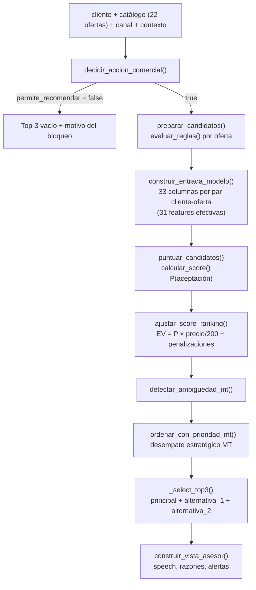

# 🧠 Arquitectura del Motor NBO y el Modelo Predictivo

> Cómo se decide qué ofrecer a cada cliente. Cubre `backend/Motor/`,
> `backend/inferencia_modelo.py` y el artefacto `modelo_propension_v2_candidato.joblib`.

---

## 1. Principio de diseño: probabilidad y negocio, separados

El motor mantiene una frontera estricta entre tres responsabilidades. Es la
decisión de arquitectura más importante del sistema y explica por qué está
partido en tres archivos:

| Módulo | Responsabilidad | Qué **no** hace |
|---|---|---|
| `motor_reglas_negocio.py` | Elegibilidad y ajustes comerciales | No carga datos, no llama al modelo, no conoce el backend |
| `inferencia_modelo.py` | Contrato inmutable con el `.joblib` | No aplica reglas ni reordena |
| `motor_oficial.py` | Orquesta ambos y arma el Top-3 | No accede a CSV ni a HTTP |

Consecuencia práctica: **la probabilidad que devuelve el modelo nunca se altera
ni se renombra**. Las penalizaciones comerciales viven en un campo aparte
(`score_ranking`) junto con la lista de `ajustes` que las produjo, así que
siempre se puede auditar por qué una oferta subió o bajó.

`motor_oficial.py` recibe cliente y catálogo ya cargados: es ejecutable fuera del
backend, en un notebook o en un test.

### Versionado

```python
MODEL_VERSION = "v2_generalizable_31"   # motor_oficial.py
RULES_VERSION = "2.1.0"                 # motor_reglas_negocio.py
```

Ambas acompañan cada respuesta, de modo que un resultado guardado siempre dice
con qué modelo y con qué reglas se produjo.

---

## 2. El pipeline completo



### API pública del motor

| Función | Uso |
|---|---|
| `recomendar_top3(cliente, ofertas, canal, contexto)` | Recomendación completa |
| `evaluar_oferta(cliente, oferta, canal, contexto)` | Puntúa **una** oferta concreta |
| `recomendar_rebate(cliente, ofertas, oferta_rechazada_id, motivo)` | Contraoferta tras rechazo |
| `preparar_candidatos` / `puntuar_candidatos` / `finalizar_recomendacion` | Piezas sueltas, para inferencia por lotes |

Esa última terna es la que usa `NBORouter.enriquecer_clientes()` para puntuar
muchos clientes en una sola llamada al modelo.

---

## 3. Capa 1 — Compuerta comercial (`decidir_accion_comercial`)

Se evalúa **antes de tocar el modelo**. Si bloquea, no se calcula ninguna
probabilidad: no se gasta inferencia en un cliente al que no se debe ofrecer.

Orden de precedencia (el primero que aplica corta la evaluación):

| # | Señal de contexto | Acción | ¿Recomienda? |
|---|---|---|---|
| 1 | `oposicion_comercial` | `NO_CONTACTAR` | ❌ |
| 2 | `bloqueo_presion_activo` | `ESPERAR` | ❌ |
| 3 | `reclamo_activo` / `averia_activa` / `incidencia_en_interaccion` | `NO_OFRECER` | ❌ |
| 4 | Call Out sin `consentimiento_comercial` | `NO_CONTACTAR` | ❌ |
| 5 | Call Out con consentimiento **desconocido** | `VALIDAR_CONSENTIMIENTO` | ✅ prepara, no llama |
| 6 | Call Out con consentimiento vigente | `CONTACTAR` | ✅ |
| 7 | Resto de canales | `RECOMENDACION_DISPONIBLE` | ✅ solo si surge la oportunidad |

Dos detalles que importan:

**`optional_bool()` distingue "no" de "no lo sé".** Un consentimiento ausente no
se trata como negativo: produce `VALIDAR_CONSENTIMIENTO`, que permite preparar
la recomendación pero prohíbe llamar. Confundir ambos casos sería un problema
regulatorio.

**`estado_regla` declara la procedencia del dato:**

- `SIMULADA_MVP` — el contexto viene de la demo (`escenario_simulado=True`)
- `PENDIENTE_DATO` — falta un dato externo, se nombra en `dato_pendiente`
- `APLICADA_CON_DATO_EXTERNO` — señal real de un sistema Movistar

Hoy la demo produce siempre `SIMULADA_MVP`, y eso queda visible en la respuesta.

---

## 4. Capa 2 — Elegibilidad por oferta (`evaluar_reglas`)

Devuelve un `RuleEvaluation` con dos niveles: **exclusiones** (descartan la
oferta) y **advertencias** (la penalizan pero la dejan competir).

### Exclusiones

| Código | Condición |
|---|---|
| `MT_CLIENTE_NO_ELEGIBLE` | Oferta MT y `elegible_mt = false` |
| `MT_CLIENTE_YA_CONVERGENTE` | Oferta MT y el cliente ya es MT |
| `OFERTA_YA_CONTRATADA` | Coincide con `plan_actual_id` u `oferta_hogar_id` |
| `RIESGO_ALTO_RESTRINGE_EQUIPO` | Riesgo alto + oferta de tipo equipo |
| `UPGRADE_MOVIL_REQUIERE_SERVICIO_MOVIL` | Upgrade móvil sin línea móvil |
| `UPGRADE_HOGAR_REQUIERE_SERVICIO_HOGAR` | Upgrade hogar sin servicio hogar |
| `EQUIPO_HOGAR_REQUIERE_SERVICIO_HOGAR` | Equipo hogar sin servicio hogar |
| `ADICIONAL_MOVIL_REQUIERE_SERVICIO_MOVIL` | Paquete móvil sin línea móvil |

El backend puede añadir exclusiones vía contexto:
`ofertas_rechazadas_bloqueadas` (→ `OFERTA_EN_ESPERA_TRAS_RECHAZO`),
`ofertas_no_disponibles` y `restricciones_ofertas`.

### Advertencias (no canibalización)

Solo se evalúan **dentro del mismo segmento** y **si la oferta no es MT**:

- `POSIBLE_DOWNGRADE_PRECIO` — la nueva cuesta menos que la actual
- `MENOR_CAPACIDAD_DATOS` — ofrece menos GB que el plan vigente

La excepción para MT es intencional: en una oferta convergente pagar menos es el
argumento de venta, no un downgrade.

### Nivel de riesgo

```python
alto:  meses_moroso >= 2  o  dias_mora_prom > 10
medio: meses_moroso >= 1  o  dias_mora_prom > 5
bajo:  resto
```

---

## 5. Capa 3 — El modelo (`inferencia_modelo.py`)

Contrato deliberadamente mínimo: `calcular_score(datos, ruta_modelo)` recibe un
DataFrame con las 33 columnas exactas y devuelve `score_aceptacion`.

### 33 columnas de contrato, 31 features efectivas

El nombre del modelo (`v2_generalizable_31`) y el contrato (33 columnas) no se
contradicen: **el pipeline recibe 33 y descarta 2 internamente**.

```text
Pipeline
├── preprocessing (ColumnTransformer)
│   ├── numeric      → 10 columnas
│   ├── categorical  → 21 columnas
│   └── remainder='drop' → 2 columnas DESCARTADAS:
│                          monto_facturado_prom_6m, oferta_id
└── model → LogisticRegression        10 + 21 = 31 features efectivas
```

Cada exclusión tiene su motivo:

| Columna descartada | Motivo |
|---|---|
| `monto_facturado_prom_6m` | Correlación casi perfecta con `monto_facturado_prom`: redundante |
| `oferta_id` | Usar la **identidad** de la oferta impide puntuar ofertas nuevas; el modelo aprende de sus atributos (precio, GB, tipo, segmento) |

Esa segunda exclusión es justamente lo que hace *generalizable* al candidato
elegido (§10). El contrato sigue exigiendo las 33 columnas porque el
`ColumnTransformer` fue ajustado con ellas presentes: quitarlas del DataFrame de
entrada rompería la inferencia. `GET /api/model/status` reporta
`features_total: 31` y `exclusiones: ["oferta_id", "monto_facturado_prom_6m"]`,
que es la cuenta efectiva.

```python
faltantes = [c for c in COLUMNAS_MODELO if c not in datos.columns]
if faltantes:
    raise ValueError(f"Faltan columnas requeridas: {faltantes}")
```

Falla ruidosamente antes de predecir. Un cambio de esquema se detecta al
instante, no como una predicción silenciosamente equivocada.

Las 22 columnas declaradas en `COLUMNAS_CATEGORICAS` se convierten a `str` con
el mismo formato del entrenamiento — un desalineamiento aquí produce probabilidades sutilmente mal
sin lanzar error. Hay además un parche de compatibilidad para diferencias de
versión de scikit-learn (atributo `multi_class` ausente).

### Construcción de la entrada (`construir_entrada_modelo`)

Las 33 columnas del contrato combinan cliente (24 del dataset), oferta y canal.
Tres transformaciones no obvias:

| Regla | Motivo |
|---|---|
| `gb_incluidos = 9999` → `gb_incluidos_modelo = NaN` + `oferta_ilimitada = True` | 9999 es un centinela, no una cantidad: como número distorsionaría el modelo |
| `tipo_cliente = "sin_movil"` si no tiene móvil | Ausencia explícita en vez de nulo |
| `oferta_hogar_id = "sin_servicio_hogar"`, `canal_mas_usado = "sin_actividad"` | Igual criterio |

Los valores string se normalizan a minúsculas salvo los identificadores
(`oferta_id`, `oferta_hogar_id`, `plan_actual_id`).

---

## 6. Capa 4 — Ranking por valor esperado (`ajustar_score_ranking`)

Aquí ocurre la decisión de negocio más consecuente. **No se rankea por
probabilidad pura, sino por valor esperado:**

```python
MAX_PRECIO_REF = 200.0
ev_score = probabilidad * (precio / MAX_PRECIO_REF)
score    = clip(ev_score + suma_de_penalizaciones, 0, 1)
```

La división entre un techo de catálogo de S/ 200 mantiene el score en `[0, 1]`
sin cambiar el orden.

### Penalizaciones

| Código | Valor | Cuándo |
|---|---|---|
| `PENALIZA_DOWNGRADE` | −0.02 | Advertencia `POSIBLE_DOWNGRADE_PRECIO` |
| `PENALIZA_MENOR_CAPACIDAD` | −0.03 | Advertencia `MENOR_CAPACIDAD_DATOS` |
| `PENALIZA_PRECIO_CON_RIESGO_ALTO` | −0.04 | Riesgo alto y precio > facturación media |

> **Implicación a tener presente:** al multiplicar por el precio, una oferta cara
> con probabilidad baja puede superar a una barata con probabilidad alta. Es
> intencional —maximiza ingreso capturado, no tasa de conversión— pero significa
> que el Top-1 **no es** "la oferta que el cliente más probablemente acepte". Si
> el objetivo del negocio fuera conversión, esta línea es la que habría que
> cambiar.

---

## 7. El caso Movistar Total

MT recibe tratamiento explícito porque es el producto estratégico y porque el
modelo **no separa bien sus variantes**.

### Detección de ambigüedad (`detectar_ambiguedad_mt`)

Solo aplica si el cliente es `elegible_mt`, no es ya MT, y hay ≥2 ofertas MT
candidatas. Se activa cuando **ambas** condiciones se cumplen:

```python
score_range = max(P_mt) - min(P_mt)
applies = score_range <= 0.01  and  (best_global - best_mt) <= 0.01
```

Es decir: el modelo no distingue entre las variantes MT **y** MT es competitiva
frente al mejor global. En ese caso el motor admite que no puede decidir y
devuelve una pregunta para el cliente:

> *"¿Qué prefieres priorizar: pagar menos, tener más gigas o contar con datos
> ilimitados?"*

Las opciones se etiquetan automáticamente como `pagar_menos` (la más barata),
`datos_ilimitados` (gb ≥ 9999) o `mas_gigas`. La respuesta llega por
`POST /api/recomendaciones/{rec_id}/preferencia-mt` y fija `preferencia_mt` en
el contexto, que se recalcula.

Es una decisión de diseño honesta: en vez de inventar una desambiguación que el
modelo no soporta, traslada la elección a quien sí la tiene.

### Desempate estratégico (`_ordenar_con_prioridad_mt`)

Una oferta MT se promueve al primer puesto si:

- el cliente eligió esa variante (`motivo: PREFERENCIA_CLIENTE`), **o**
- el líder global no es MT y la diferencia es ≤ `MT_SCORE_TIE_TOLERANCE` (0.01)
  (`motivo: DESEMPATE_ESTRATEGICO_MT`)

La promoción queda registrada en `tie_audit` con la oferta promovida, la
diferencia exacta y el motivo. **Nunca es silenciosa.**

---

## 8. Selección del Top-3 (`_select_top3`)

Los tres puestos tienen roles distintos, no son simplemente los tres mejores:

| Rol | Criterio |
|---|---|
| `oferta_principal` | Mejor `score_ranking` (tras el desempate MT) |
| `alternativa_1` | **Mejor score entre las más baratas que la principal** — munición para la objeción de precio |
| `alternativa_2` | Si el cliente **no** es elegible MT, se prefiere un `tipo_oferta` distinto a los ya elegidos (diversificación); si sí lo es, el siguiente por score |

El segundo puesto está pensado para el rebate: cuando el cliente dice "muy caro",
el asesor ya tiene en pantalla la mejor opción más económica.

---

## 9. Rechazo y rebate

### Hipótesis de objeción (`motivo_rechazo_probable`)

Antes de que el cliente hable, el motor anticipa la objeción probable:

| Motivo | Condición |
|---|---|
| `precio` | Precio > facturación media × 1.15 |
| `no_confia` | `n_reclamos >= 3` |
| `no_necesita` | Advertencia `MENOR_CAPACIDAD_DATOS` |
| `otro` | Sin señal suficiente |

Se devuelve con `"confianza": "heuristica"` y el docstring lo dice sin rodeos:
*"Genera una hipótesis explicable, no una predicción causal."*

### Estrategia de contraoferta (`estrategia_rebate`)

| Motivo | Acción | Criterio |
|---|---|---|
| `precio` | `ofrecer_alternativa` | `menor_precio` |
| `no_necesita` | `ofrecer_alternativa` | `otra_categoria` |
| `ya_tiene_similar` | `ofrecer_alternativa` | `producto_complementario` |
| `mal_momento` | `programar_seguimiento` | `no_insistir` |
| `no_confia` | `derivar_canal_asistido` | `resolver_dudas_antes_de_ofrecer` |
| `otro` | `ofrecer_alternativa` | `siguiente_mejor_score` |

Dos motivos **no generan contraoferta**: `mal_momento` agenda seguimiento y
`no_confia` deriva a canal asistido. Insistir en esos casos deteriora la relación.

`recomendar_rebate()` excluye la oferta rechazada, filtra el resto según el
criterio y elige el mejor `score_ranking` de lo que queda.

---

## 10. El modelo predictivo

### Artefacto

`backend/Modelo/modelo_propension_v2_candidato.joblib` — versión
`v2_generalizable_31`. Regresión logística calibrada sobre pipeline de
scikit-learn.

### Datos de entrenamiento

| Métrica | Valor |
|---|---|
| Filas de campaña | 300.112 |
| Filas de modelado | 207.046 |
| Clientes únicos | 87.402 |
| Aceptadas / Rechazadas | 95.414 / 111.632 |
| Tasa de aceptación | 46,1 % |
| Excluidas: pendientes o no contactados | 45.494 |
| Excluidas: rebates | 47.572 |

**Los rebates se excluyen del modelo primario.** Un rebate es una segunda oferta
condicionada a un rechazo previo: mezclarlo con ofertas primarias contaminaría
la variable objetivo. El rebate se resuelve con reglas (§9), no con el modelo.

**No se usa SMOTE.** El reporte lo justifica: la clase positiva no es rara
(46 %) y el problema dominante es sesgo de exposición MT/no-MT, que el
sobremuestreo sintético no corrige.

**Validación:** `GroupKFold` de 5 folds **agrupado por cliente**, solo dentro de
Train. Agrupar por cliente evita que el mismo cliente aparezca en train y
validación inflando las métricas. El test permanece cerrado
(`test_reserved_opened: false`).

### Comparación de candidatos

| Candidato | Feats | PR-AUC | ROC-AUC | Brier | Lift@10 | Cal. MAE |
|---|---|---|---|---|---|---|
| `baseline_33` | 33 | 0,5785 | 0,5902 | 0,2365 | 1,682 | 0,0089 |
| `sin_facturacion_redundante` | 32 | 0,5785 | 0,5902 | 0,2365 | 1,681 | 0,0092 |
| **`generalizable_sin_oferta_id`** ✅ | **31** | **0,5788** | **0,5904** | 0,2365 | 1,683 | 0,0091 |
| `class_weight_balanced_diagnostico` | 33 | 0,5786 | 0,5902 | 0,2379 | 1,682 | 0,0362 |
| `hist_gradient_boosting_interacciones` | 31 | 0,5767 | 0,5885 | 0,2365 | 1,681 | 0,0058 |

**Se eligió `generalizable_sin_oferta_id`**: usa atributos de la oferta en lugar
de su identidad, de modo que puede puntuar ofertas nuevas que no existían en el
entrenamiento. Con un rendimiento prácticamente idéntico, esa capacidad de
generalizar decide.

También es revelador que el gradient boosting **no supere** a la regresión
logística: no hay interacciones no lineales relevantes que capturar, así que el
modelo simple, calibrado e interpretable es la opción correcta.

### Lectura honesta de las métricas

- **ROC-AUC 0,59** es un poder discriminante modesto. El modelo aporta señal,
  pero no separa nítidamente quién acepta de quién no.
- **Lift@10 = 1,68**: el decil superior convierte 68 % mejor que el azar. Es
  aquí donde está el valor real de negocio.
- **Calibración MAE ≈ 0,009**: las probabilidades son fiables *como
  probabilidades*. Esto es lo que legitima multiplicarlas por el precio para
  obtener valor esperado (§6) — un modelo mal calibrado haría ese cálculo
  inválido, y por eso `class_weight_balanced` (MAE 0,036, 4× peor) se descartó
  pese a métricas de ranking equivalentes.

---

## 11. Salida del motor

`recomendar_top3()` devuelve, por cada una de las 3 ofertas:

```json
{
  "ranking": 1,
  "rol": "oferta_principal",
  "oferta_id": "OF021",
  "nombre_oferta": "Movistar Total Plus",
  "oferta_es_mt": true,
  "precio_mensual": 123.44,
  "probabilidad_aceptacion": 0.412,   // ← del modelo, sin tocar
  "score_ranking": 0.234,             // ← EV con penalizaciones
  "ajustes": [{"code": "...", "value": -0.02}],
  "advertencias": ["..."],
  "motivo_rechazo_probable": {"motivo": "precio", "confianza": "heuristica"},
  "vista_asesor": { "speech": {...}, "razones": [...], "alertas": [...] }
}
```

Acompañado de `decision_comercial`, `ambiguedad_mt`, `tie_audit`, `exclusiones`,
`model_version` y `rules_version`.

Cada número que ve el asesor puede rastrearse hasta la regla o el modelo que lo
produjo. Esa auditabilidad es el objetivo de toda la separación en capas.

---

## 12. Limitaciones conocidas

1. **El ranking optimiza ingreso, no conversión** (§6). Consciente, pero conviene
   validarlo con negocio.
2. **`_razones_para_asesor` es descriptivo, no causal.** Su propio docstring
   advierte que "no pretende reemplazar una explicación causal". No son valores
   SHAP: son hechos del catálogo y del perfil.
3. **El modelo se carga desde disco en cada llamada a `calcular_score`.** Con
   inferencia vectorizada se paga una vez por request, pero es una carga
   repetida que podría cachearse.
4. **`MAX_PRECIO_REF = 200.0` está fijo en el código.** Si el catálogo incorpora
   ofertas más caras, ese techo deja de ser representativo.
5. **Las señales de contexto son simuladas** en la demo (`SIMULADA_MVP`). La
   integración con los sistemas reales de reclamos, averías y consentimiento
   está pendiente.
