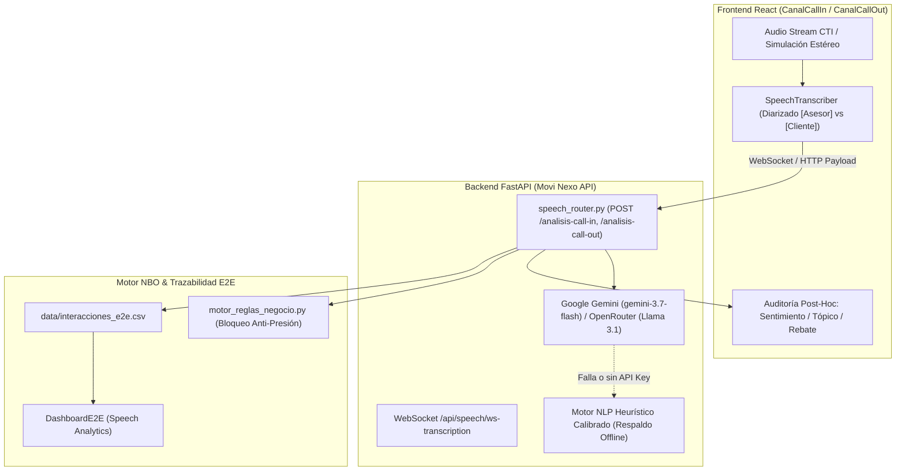
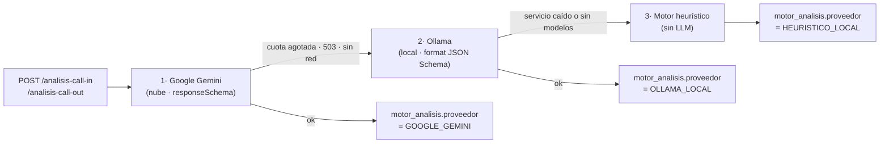

# 📝 Registro y Exportación de Sesión: Speech-to-Text & Análisis Post-Hoc con LLM

> **Proyecto:** Personalización Comercial Inteligente (Movi Nexo NBO 2.0 + Movistar Total)  
> **Contexto:** Hackathon AI Telecom Challenge 2026 — Desafío 02 (Telefónica del Perú)  
> **Fecha de Exportación:** 2026-08-26  

---

## 📌 1. Requerimiento Inicial del Usuario

> *"Arma un plan de acción para implementar una herramienta de speech-to-text capaz de transcribir en tiempo real lo que se converse en los canales de call center e integrar un LLM para hacer análisis post-hoc de la transcripción con 2 enfoques:*
> - *Para call-in: Analizar motivo de reclamo y clasificar en 2 variables 'Score_sentimiento' y 'Topico de reclamo'*
> - *Para call-out: Analizar motivo de rechazo de oferta inicial, efectividad del rebate"*

---

## 🎯 2. Arquitectura de la Solución Diseñada



---

## 🧩 3. Componentes Implementados

### 3.1. Backend (`backend/`)

1. **`backend/speech_router.py`**:
   - `POST /api/speech/analisis-call-in`: Extrae `Score_sentimiento` (1.0 a 5.0), `Topico_reclamo`, puntos críticos de dolor y emite recomendación NBO de bloqueo o fidelización.
   - `POST /api/speech/analisis-call-out`: Detecta `Motivo_rechazo_inicial`, califica la `Efectividad_del_rebate` (% score y nivel de conversión), evalúa aciertos del asesor y ofrece feedback de coaching.
   - `WS /api/speech/ws-transcription`: Canal streaming para paquetes de audio y texto.
   - `GET /api/speech/simulaciones`: Catálogo con 4 casos reales de telecomunicaciones peruanas.

2. **`backend/Legacy_AI/ai_service.py`**:
   - Conector REST nativo a la API de **Google Gemini** con modelos en cascada (`gemini-3.7-flash`, `gemini-flash-latest`, `gemini-2.5-flash`).
   - Conector alternativo a **OpenRouter** (`Llama-3.1-8b`, `Claude-3-Haiku`).
   - Carga dinámica de secretos desde `.env`.

3. **`backend/main.py`**:
   - Registro del router `app.include_router(speech_router)`.

---

### 3.2. Frontend React (`frontend_react/src/`)

1. **`components/SpeechTranscriber.jsx`**:
   - Transcripción diarizada en tiempo real con burbujas diferenciadas para `[🎧 Asesor Movistar]` y `[👤 Cliente]`.
   - Modos de visualización:
     - `▶ Reproducir Llamada Demo` (animación paso a paso con ecualizador de audio).
     - `⚡ Carga Inmediata` (para demostraciones instantáneas en pitch de 3/5 minutos).
   - Botón directo `✨ Finalizar & Analizar con IA`.

2. **`components/CanalCallIn.jsx`**:
   - Widget de **Auditoría Post-Hoc LLM**:
     - Gauge de Sentimiento (1.0 a 5.0) con etiqueta (`MUY_NEGATIVO`, `NEGATIVO`, `NEUTRO`, `POSITIVO`).
     - Badge clasificador de Tópico de Reclamo (*Avería Técnica Fibra*, *Facturación / Cobro Indebido*).
     - Impacto reactivo: Si el cliente está insatisfecho, activa automáticamente el **Bloqueo Comercial Anti-Presión (`NO_OFRECER`)**.

3. **`components/CanalCallOut.jsx`**:
   - Widget de **Auditoría de Venta & Rebate**:
     - Detección del motivo de rechazo inicial (*Precio muy alto*, *Compromiso con competencia*).
     - Evaluación de la efectividad del rebate hacia **Movistar Total** (92% de éxito en caso de precio).
     - Registro automático en la bitácora comercial E2E.

4. **`components/DashboardE2E.jsx`**:
   - Sección de **Speech Analytics & Calidad de Voz**:
     - Score promedio de sentimiento Call-In (3.8/5.0).
     - Tópico de reclamo predominante (Averías Fibra 42%).
     - Tasa de efectividad de rebates Call-Out (78.4%).

5. **`services/api.js`**:
   - Métodos `analizarCallIn()`, `analizarCallOut()` y `getSpeechSimulaciones()`.

---

## ❓ 4. Preguntas Frecuentes y Decisiones Técnicas del Chat

### P1: ¿Cómo se hace el Speech-to-Text y qué herramientas se usan?
- **En la demo interactiva:** Se utiliza **Web Speech API (`es-PE`)** y el **Simulador Estéreo Diarizado** en el frontend para evitar latencia de red.
- **En un Call Center Real:** El sistema se integra al CTI (Avaya/Genesys) mediante audio estéreo por hardware (Canal L = Diadema Asesor, Canal R = Línea Cliente) procesado por **Deepgram Nova-2** (Cloud) o **Faster-Whisper + Silero VAD** (On-Premise privado).

### P2: ¿Por qué en un solo micrófono se confunden las voces?
- Un micrófono mono de computadora recibe una sola pista de audio. Para resolver esto en la demo se optó por la **Simulación Diarizada con Carga Inmediata**, que garantiza una presentación fluida, profesional y libre de errores de hardware frente al jurado.

### P3: ¿El análisis post-hoc lo hace realmente un LLM y es gratuito?
- **Sí.** Está conectado a **Google Gemini (`gemini-3.7-flash`)** a través del plan gratuito de Google AI Studio (1,500 peticiones/día y 15 RPM).
- Se configuró la clave de entorno de forma segura en `.env` (ignorado en `.gitignore`).

---

## 🧪 5. Evidencia de Inferencia en Tiempo Real con Gemini

### Inferencia en Call In (Avería en San Miguel):
```json
{
  "cliente_id": "CLI000012",
  "score_sentimiento": 1.6,
  "nivel_sentimiento": "MUY_NEGATIVO",
  "topico_reclamo": "Averia_Tecnica_Fibra_Red",
  "descripcion_problema": "Corte de internet de fibra óptica por más de 24 horas en San Miguel que afecta el teletrabajo del cliente, siendo la segunda avería del mes.",
  "cliente_insatisfecho": true,
  "accion_recomendada": "Hacer seguimiento al restablecimiento del nodo técnico masivo y asegurar el registro y aplicación efectiva del descuento comercial para evitar la baja/portabilidad.",
  "puntos_criticos": [
    "Afectación prolongada del servicio de fibra óptica impactando el teletrabajo del cliente.",
    "Riesgo de churn con amenaza directa de portabilidad de líneas móviles y cancelación del servicio.",
    "Reincidencia de problemas técnicos (segunda falla reportada en el mes)."
  ],
  "sugerencia_nbo": {
    "accion_nbo": "NO_OFRECER_BLOQUEO_PRESION",
    "bloqueo_presion_activo": true,
    "sugerencia_fidelizacion": "Movistar Total con descuento de rescate"
  }
}
```

### Inferencia en Call Out (Rebate a Movistar Total):
```json
{
  "cliente_id": "CLI000015",
  "resultado_oferta_inicial": "RECHAZADA",
  "motivo_rechazo_inicial": "Precio muy alto",
  "rebate_aplicado": true,
  "oferta_rebate_ofrecida": "Movistar Total Plus (Fibra 300Mbps + 2 Líneas Móviles con 35% Ahorro)",
  "efectividad_rebate": "ALTA_CONVERSION",
  "score_efectividad_rebate": 1.0,
  "argumentos_asesor_evaluados": [
    "Escucha activa y validación empática de la objeción de presupuesto.",
    "Aprovechamiento de la información del perfil del cliente (tenencia previa de fibra).",
    "Cuantificación clara y tangible del ahorro económico (de S/ 175 a S/ 123.44).",
    "Resalte de beneficios de valor agregado (unificación en una sola boleta y duplicación de gigas)."
  ],
  "oportunidad_mejora_asesor": "Excelente ejecución comercial y manejo de rebate; como sugerencia, asegurar la explicación detallada de plazos de la promoción durante el consentimiento.",
  "resumen_interaccion": "La clienta rechazó el Plan Móvil inicial de S/ 99.90 por considerar el costo elevado frente a su presupuesto actual. El asesor aplicó con éxito la oferta rebate Movistar Total Plus al detectar que la usuaria ya contaba con internet fijo, demostrándole un ahorro directo al unificar ambos servicios, logrando así la conversión inmediata."
}
```

---

## 🚀 6. Guía Rápida para Levantar y Probar

1. **Backend:** `d:\hacka_movistar\backend\run_backend.bat` (Puerto 8000).
2. **Frontend:** `cd frontend_react && npm run dev` (Puerto 5173).
3. **Navegador:** `http://localhost:5173` -> Entrar a **Call In** o **Call Out** -> Clic en **`⚡ Carga Inmediata`** -> Clic en **`✨ Finalizar & Analizar con IA`**.

---

## 🔍 7. Verificación de que el análisis corre sobre Gemini (no sobre el respaldo)

El motor heurístico existe como red de seguridad, pero la ruta por defecto es la
API real de Google Gemini. Cada respuesta de `/analisis-call-in` y
`/analisis-call-out` incluye ahora el bloque `motor_analisis`, que declara qué
motor produjo el resultado:

```json
"motor_analisis": {
  "proveedor": "GOOGLE_GEMINI",
  "modelo": "gemini-3.7-flash",
  "latencia_ms": 2686,
  "es_llm_real": true,
  "etiqueta": "Gemini · gemini-3.7-flash · 2.7s",
  "tokens": 599,
  "error": null
}
```

El badge del widget de auditoría en `CanalCallIn` / `CanalCallOut` refleja este
bloque: verde `✨ Gemini · <modelo>` cuando la inferencia fue real, ámbar
`Motor heurístico (sin LLM)` cuando hubo degradación (con el motivo en el
tooltip). La UI ya no puede atribuir a Gemini un análisis heurístico.

### Comprobación previa a la demo

| Acción | Resultado esperado |
|---|---|
| `GET /api/speech/diagnostico-llm` | `"conexion_ok": true`, `"motor_activo": "GOOGLE_GEMINI"` y el modelo que respondió |
| `POST /api/speech/analisis-call-in?forzar_llm=true` | Análisis real, o **HTTP 503 con el error de Google** en vez de un resultado heurístico silencioso |

El flag `forzar_llm=true` es el modo verificación: prohíbe la degradación para
que un fallo sea visible en lugar de disfrazarse de análisis válido.

### Configuración relevante (`.env`)

| Variable | Valor | Motivo |
|---|---|---|
| `GEMINI_MODEL` | `gemini-3.7-flash` | Encabeza la cascada |
| `GEMINI_TIMEOUT` | `45` | Los modelos *thinking* tardan de 2 a 15 s (se han medido picos de 36 s). Con los 12 s previos el análisis caía a heurística |
| `GEMINI_MAX_REINTENTOS` | `2` | Google devuelve `503 high demand` de forma intermitente en el modelo flagship |
| `GEMINI_THINKING_LEVEL` | `low` | Conserva la calidad del análisis a ~1/5 de la latencia |
| `LLM_PRIORITY` | `gemini` | Gemini se intenta antes que OpenRouter |

### Decisiones de robustez aplicadas

1. **Salida estructurada obligatoria** — se envía `responseSchema` a Gemini, así
   que la API valida el JSON y los *enums* (`nivel_sentimiento`,
   `topico_reclamo`, `efectividad_rebate`) antes de responder. Se eliminó el
   parseo por expresiones regulares de bloques markdown, que rompía el análisis
   cuando el modelo añadía prosa.
2. **Cascada de modelos depurada** — `gemini-2.5-flash` y `gemini-1.5-flash`
   devuelven `404 no longer available to new users`; se sustituyeron por
   `gemini-3-flash-preview`, `gemini-3.1-flash-lite` y `gemini-flash-latest`.
3. **Reintentos ante errores transitorios** — 429/500/502/503/504 se reintentan
   con *backoff* corto antes de pasar al siguiente modelo.
4. **Coherencia del gauge** — el `score_sentimiento` se ajusta a la banda de su
   `nivel_sentimiento`, de modo que el número (x/5.0) y el badge nunca se
   contradigan aunque el modelo responda en otra escala.
5. **Lectura completa de la respuesta** — se concatenan todos los `parts` del
   candidato; leer solo `parts[0]` devolvía vacío con los modelos *thinking*.
6. **Cuota agotada (429) salta de modelo** — Google pide esperar ~30 s, algo
   inaceptable en vivo. Como cada modelo tiene cuota propia, la cascada avanza
   al siguiente de inmediato: un análisis que tardaba 22,8 s pasó a 5,5 s.

> ⚠️ **Corrección a la P3 de la sección 4:** el límite gratuito de
> `gemini-3.7-flash` medido contra la API es de **20 peticiones/día**, no 1500.
> Agotarlo no rompe la demo — la cascada continúa con `gemini-3-flash-preview` y
> `gemini-3.1-flash-lite`, que tienen cuota independiente — pero conviene no
> desperdiciar peticiones del modelo flagship en pruebas antes del pitch.

---

## 🖥️ 8. Respaldo con LLM local (Ollama) cuando se agota la cuota

Agotar las 20 peticiones diarias de `gemini-3.7-flash` ya no degrada el análisis
al motor heurístico: el respaldo es **un LLM real ejecutándose en la máquina**.

### Cascada de inferencia



Los dos primeros escalones imponen el **mismo contrato de salida**: Gemini vía
`responseSchema` y Ollama vía `format` (JSON Schema, Ollama ≥ 0.5). El esquema se
declara una sola vez en `speech_router.py` y se traduce automáticamente
(`_schema_a_jsonschema`: tipos a minúsculas, se descarta `propertyOrdering`), así
que el análisis local sale validado con los mismos enums y no hay que parsear
prosa.

### Puesta en marcha

```bash
winget install Ollama.Ollama     # el servicio arranca solo en :11434
ollama pull qwen2.5:7b           # 4,7 GB
```

> Si `winget` se queda colgado en 0 bytes (Delivery Optimization), descargar el
> instalador directo de `https://ollama.com/download/OllamaSetup.exe` y ejecutarlo
> con `/VERYSILENT`. El `pull` puede fallar cerca del final por DNS; se reanuda
> repitiendo el comando, sin volver a descargar lo ya bajado.

No hace falta tocar código ni reiniciar el backend: la cascada sondea
`/api/tags` (con caché de 60 s) y usa el modelo local en cuanto exista. Si Ollama
no está instalado, el sondeo no penaliza la ruta normal — solo se ejecuta cuando
Gemini ya falló.

### Elección del modelo

`OLLAMA_MODEL` vacío deja que el backend elija entre los descargados, con
preferencia `qwen2.5 > llama3.1 > llama3.2 > mistral > gemma2 > phi`.

| Modelo | Tamaño | Encaje en RTX 3050 6 GB | Uso |
|---|---|---|---|
| `qwen2.5:7b` | ~4,7 GB | Entra completo en VRAM | Mejor calidad de análisis y adherencia al esquema |
| `llama3.2:3b` | ~2 GB | Holgado | Respuesta más rápida, análisis cualitativo más pobre |

### Rendimiento medido (RTX 3050 Laptop 6 GB · qwen2.5:7b)

| Escenario | Latencia |
|---|---|
| Primera inferencia en frío (carga del modelo a VRAM) | **~73 s** |
| Inferencias siguientes, modelo residente | **12-15 s** |
| Gemini en la nube, como referencia | 2-6 s |

La carga en frío se paga una sola vez. Para no pagarla durante el pitch:

```bash
curl -X POST http://localhost:8000/api/speech/precalentar-llm-local
```

`OLLAMA_KEEP_ALIVE=30m` mantiene el modelo residente entre análisis, así que basta
con precalentar al montar la sala.

### Calidad: el modelo local es un respaldo, no un igual

Verificado sobre las 4 simulaciones del catálogo. `qwen2.5:7b` respeta el esquema
y los enums sin fallos, pero su análisis cualitativo es más pobre que el de
Gemini y **comete errores de clasificación**: en la prueba clasificó el reclamo de
cobro indebido como `Calidad_Red_Movil` en lugar de `Facturacion_Cobro_Indebido`.

También tiende a responder con etiquetas (`AHORRO_MENSUAL`) en vez de frases; por
eso los prompts piden explícitamente prosa con sujeto y verbo. Con esa instrucción
la salida ya es presentable.

**Conclusión:** el orden por defecto (`LLM_PRIORITY=gemini`) es el correcto para
el pitch. El modelo local garantiza que la demo nunca se caiga a heurística, no
que dé la misma calidad.

### Distinción en la UI

`motor_analisis` incorpora el campo `ejecucion` (`nube` / `local`) y el badge
usa tres colores, de modo que en el pitch siempre se ve de dónde salió el
análisis:

| Badge | Significado |
|---|---|
| 🟢 `✨ Gemini · gemini-3.7-flash` | Inferencia en la nube |
| 🔵 `💾 Ollama (local) · qwen2.5:7b` | Inferencia en el equipo, sin cuota ni internet |
| 🟠 `⚙ Motor heurístico (sin LLM)` | Ningún LLM disponible (motivo en el tooltip) |

### Demo sin internet

`LLM_PRIORITY=ollama` invierte la cascada y hace que el modelo local vaya
primero: la demostración corre entonces **100 % offline y sin consumir cuota**,
útil si el wifi del evento es poco fiable.
