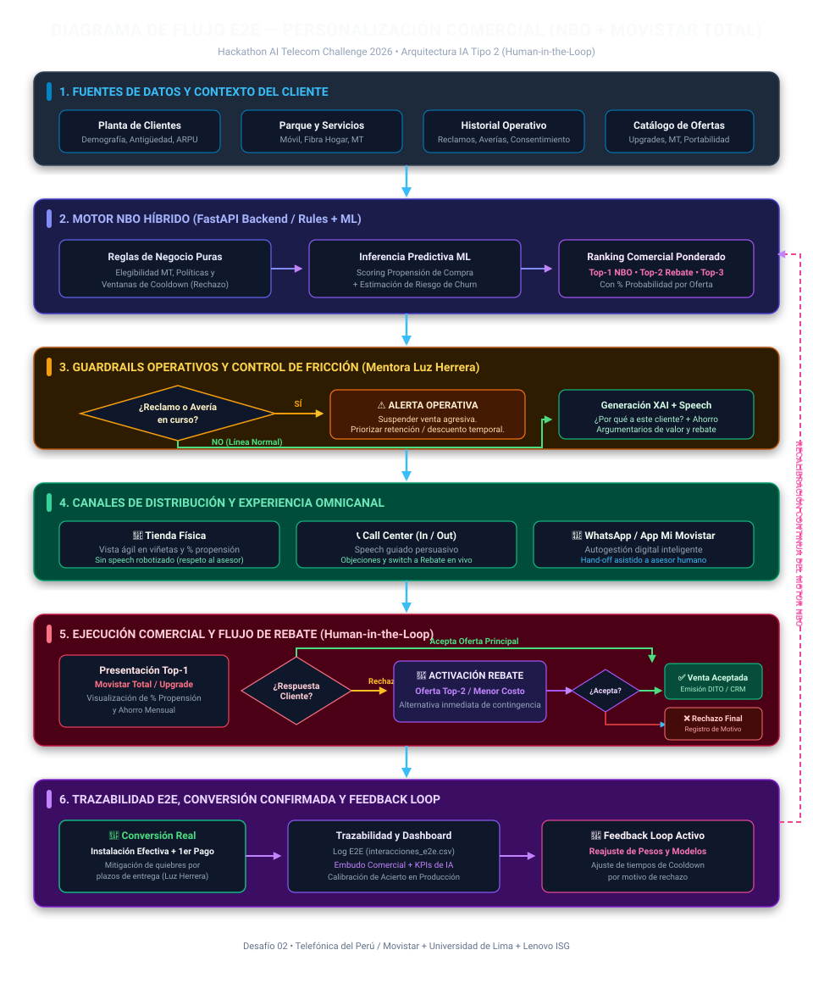
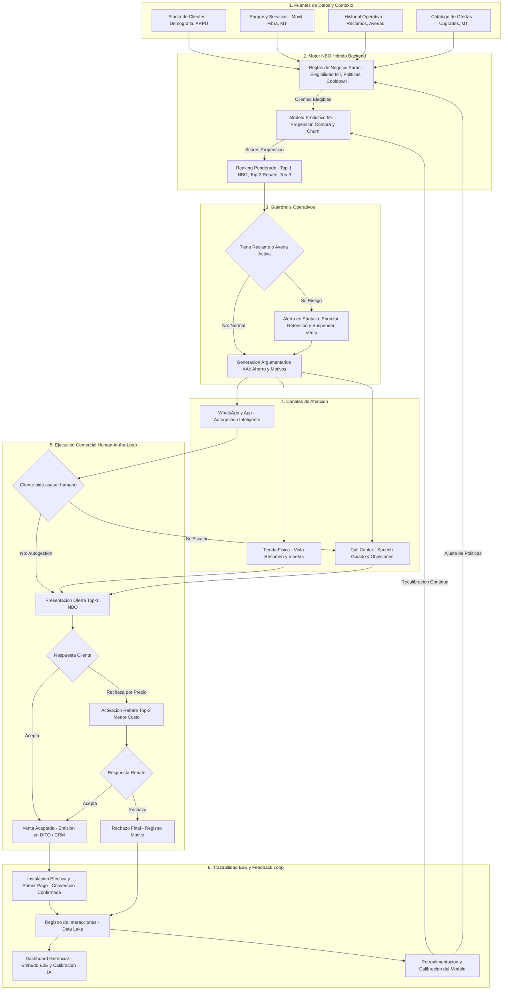

# 🗺️ Diagrama de Flujo E2E — Personalización Comercial Inteligente (NBO + Movistar Total)

> **Contexto:** Hackathon AI Telecom Challenge 2026 (Telefónica del Perú / Movistar) — Desafío 02  
> **Área:** Crecimiento, Ventas y Fidelización B2C  
> **Alineamiento:** Directrices de Mentora Luz Herrera & Arquitectura de IA Tipo 2 (*Human-in-the-loop*)

---

## 1. Diagrama Visual del Flujo E2E

A continuación se presenta la arquitectura visual del flujo integral del proyecto:

---

## 2. Descripción Detallada por Fases

### 🔹 Fase 1: Fuentes de Datos y Contexto del Cliente
* **Planta de Clientes:** Información demográfica, antigüedad, consumo mensual, nivel de ARPU y comportamiento de pago.
* **Parque y Servicios:** Servicios contratados (Móvil Postpago, Fibra Hogar, Movistar Total).
* **Historial Operativo:** Registro de reclamos abiertos, averías técnicas en zona y validación de consentimiento de contacto (cumplimiento regulatorio).
* **Catálogo de Ofertas:** Matriz de planes, upgrades, convergencia MT y beneficios vigentes.

### 🔹 Fase 2: Motor NBO Híbrido (FastAPI Backend)
* **Reglas de Negocio Puras:** Validan consentimientos, restricciones regulatorias, elegibilidad técnica para Movistar Total (`elegible_mt`) y ventanas de enfriamiento (*cooldown* tras rechazo).
* **Inferencia Machine Learning:** Predicción de propensión de compra y estimación de riesgo de Churn (`backend/inferencia_modelo.py`).
* **Ranking Ponderado:** Generación de la terna comercial explicable:
  1. **Top-1 (NBO Principal):** Oferta óptima con mayor propensión y beneficio financiero.
  2. **Top-2 (Rebate Contingente):** Alternativa inmediata de menor costo ante objeción de precio.
  3. **Top-3 (Alternativa de Respaldo):** Plan complementario de retención.
  * *Cada oferta incluye su porcentaje de probabilidad de aceptación recomendado por la mentora Luz Herrera.*

### 🔹 Fase 3: Guardrails Operativos y Control de Fricción
* **Detección de Fricción Activa:** Validación en tiempo real de reclamos sin resolver o averías técnicas en la zona del cliente.
* **Política Operativa:** Si el cliente experimenta fallas en el servicio, se activa una **Alerta Operativa en Pantalla** que suspende la venta comercial agresiva y prioriza la resolución del problema o una oferta de retención (ej. descuento temporal mientras se soluciona la avería).
* **Explicabilidad (XAI):** Generación de argumentos claros para el asesor (*¿Por qué esta oferta?*, cálculo de ahorro mensual y diferenciales clave).

### 🔹 Fase 4: Canales de Distribución y Experiencia Omnicanal
* **🏬 Tienda Física:** Vista ágil en viñetas y porcentajes de propensión, respetando la autonomía y protocolo presencial del asesor (sin lecturas rígidas).
* **📞 Call Center (In / Out):** Guion persuasivo guiado con argumentarios de valor, manejo de objeciones y conmutador rápido hacia oferta de Rebate.
* **💬 WhatsApp / Canales Digitales:** Flujo de autogestión digital inteligente con protocolo de escalamiento (*hand-off*) hacia un asesor humano cuando se requiere asistencia personalizada.

### 🔹 Fase 5: Ejecución Comercial y Flujo de Rebate (Human-in-the-Loop)
* La IA sugiere y prioriza; el asesor humano lidera la interacción.
* Si el cliente objeta la oferta principal (Top-1) por precio, el asesor activa de inmediato la alternativa **Top-2 (Rebate)** sin perder la oportunidad de contacto.
* Cierre y emisión de la venta en plataformas oficiales (**DITO / CRM**). En caso de rechazo, se registra el motivo exacto para auditoría.

### 🔹 Fase 6: Trazabilidad E2E, Conversión Real y Feedback Loop
* **Definición de Conversión Real:** Como enfatizó la mentora Luz Herrera, la venta se consolida con la **instalación técnica efectiva y el primer pago**, evitando quiebres en el embudo por demoras logísticas.
* **Trazabilidad Integral:** Registro de cada interacción en `data/interacciones_e2e.csv`.
* **Dashboard Gerencial:** Monitoreo de tasas de conversión por canal, motivos de rechazo y **KPIs de calibración del modelo de IA** (efectividad real vs. propensión estimada).
* **Feedback Loop Activo:** Los rechazos y conversiones retroalimentan dinámicamente las reglas de negocio y los modelos para su reentrenamiento continuo.

---

## 3. Código Fuente del Diagrama (Mermaid)

Para edición o exportación en herramientas de diagramación compatibles con Mermaid:

