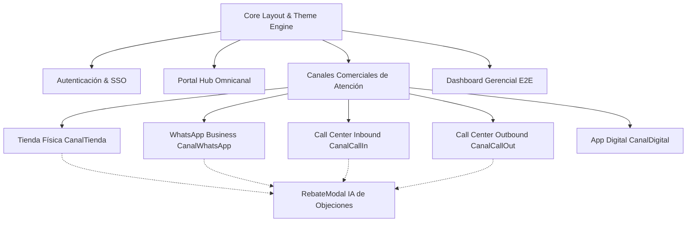

# 📱 Guía de Diseño UX/UI & Sistema de Identidad Visual — Movistar NBO 2.0

Esta guía técnica y de experiencia de usuario detalla la arquitectura completa de diseño, el stack tecnológico implementado, la distribución de componentes y los estándares visuales para garantizar una coherencia del 100% en todas las vistas y canales del ecosistema **Movistar Personalization (NBO 2.0)**.

---

## 🚀 1. Stack Tecnológico de Diseño (Design Stack)

El sistema de interfaz está construido sobre una arquitectura moderna, reactiva y ultra-optimizada:

| Tecnología | Rol en el Stack | Propósito / Beneficio |
| :--- | :--- | :--- |
| **React 18** | Framework UI Core | Arquitectura modular basada en componentes funcionales, Hooks y Context API. |
| **Tailwind CSS (v4)** | Utility-First Styling | Motor de clases utilitarias de última generación compilado a CSS nativo de alto rendimiento. |
| **CSS Custom Properties (Variables)** | Sistema de Tokens Global | Gestión dinámica de tokens de color, fondos, paneles y sombras en tiempo de ejecución. |
| **Lucide React** | Iconografía SVG Vectorial | Set de iconos corporativos consistentes, escalables y con soporte de estilos y animaciones. |
| **Recharts** | Visualización de Datos | Renderizado de gráficos SVG adaptables (Embudo de conversión, Dona de objeciones, Barras). |
| **Google Fonts Typography** | Sistema Tipográfico | *Outfit* (Titulares y marcas), *Plus Jakarta Sans* (Cuerpo de texto UI), *JetBrains Mono* (Métricas y datos numéricos). |
| **Glassmorphism & Backdrop Filter** | Efectos Visuales Premium | Desenfoques traslúcidos (`backdrop-blur-xl`), bordes iluminados y profundidad tridimensional. |
| **Theme Engine (Context + LocalStorage)** | Motor de Modo Día / Noche | Persistencia de estado en `localStorage` con mutación fluida de clases `.light` y `.dark` en el DOM. |

---

## 🎨 2. Paleta Oficial de Identidad Movistar (Design Tokens)

La paleta corporativa define la jerarquía visual de todos los elementos interactivos y estructurales:

```
┌─────────────────────────────────────────────────────────────────────────────┐
│                            PALETA OFICIAL MOVISTAR                          │
├──────────────────┬───────────┬────────────────┬─────────────────────────────┤
│ Color Corporativo│ Hex Code  │ Formato RGB    │ Rol Semántico / Uso en UI   │
├──────────────────┼───────────┼────────────────┼─────────────────────────────┤
│ Azul Movistar    │ #005C84   │ rgb(0, 92, 132)│ Fondos primarios, Navbar,   │
│ (Principal)      │           │                │ encabezados y tarjetas base │
├──────────────────┼───────────┼────────────────┼─────────────────────────────┤
│ Azul Cielo       │ #00C6D7   │ rgb(0, 198, 215│ Acentos luminosos, botones, │
│ (Sky Movistar)   │           │ )              │ bordes activos, glows y NBO │
├──────────────────┼───────────┼────────────────┼─────────────────────────────┤
│ Verde Corporativo│ #7AB800   │ rgb(122, 184, 0│ CTAs de Éxito (Cierre Venta)│
│ (Action Green)   │           │ )              │ % Ahorro, métricas de éxito │
├──────────────────┼───────────┼────────────────┼─────────────────────────────┤
│ Blanco Nieve     │ #FFFFFF   │ rgb(255, 255, 2│ Textos sobre fondos oscuros,│
│                  │           │ 55)            │ tarjetas en modo claro      │
├──────────────────┼───────────┼────────────────┼─────────────────────────────┤
│ Gris Oscuro      │ #515559   │ rgb(81, 85, 89)│ Textos secundarios, párrafos│
│ (Text Gray)      │           │                │ y etiquetas en modo claro   │
└──────────────────┴───────────┴────────────────┴─────────────────────────────┘
```

### Contrastes y Modos de Visualización

* **Modo Oscuro (Noche Movistar):**
  * Fondo de aplicación: Azul marino ultra-oscuro `#040c18` / `#061224`.
  * Paneles y Tarjetas: `rgba(0, 92, 132, 0.12)` a `rgba(6, 20, 38, 0.85)` con borde `rgba(0, 198, 215, 0.25)`.
  * Efectos Glow: Resplandores difusos en `#00C6D7` (Cielo) y `#7AB800` (Verde).
* **Modo Claro (Día Movistar):**
  * Fondo de aplicación: Gris azulado suave y limpio `#F4F7FB`.
  * Paneles y Tarjetas: Blanco puro `#FFFFFF` con sombras suaves y borde `#005C84`/15.
  * Tipografía: Titulares en `#005C84` y cuerpo en `#515559`.

---

## 🏛️ 3. Arquitectura y Distribución de Componentes UX/UI

La aplicación está distribuida en **5 capas modulares**:



---

## 📑 4. Desglose Detallado de Cada Vista y Componente

### 1. Sistema Global & Navegación (`App.jsx` + `ThemeContext.jsx` + `ThemeToggle.jsx`)
* **Ubicación:** Header fijo superior y Footer global.
* **Componentes UI:**
  * **Isotipo Movistar "M":** Caja redondeada con degradado `#005C84` a `#00C6D7` y sombra difusa.
  * **Navegador Rápido de Canales (Admin Demo):** Pestañas tipo *pills* con iconos representativos de cada canal y estado activo con borde iluminado.
  * **ThemeToggle (Sol / Luna):** Botón animado en la esquina superior derecha con detección de estado y micro-animación de rotación.
  * **Badge de Perfil de Usuario:** Indicador de estado en verde pulsante (`#7AB800`) con rol y nombre del asesor.
  * **Botón de Cierre de Sesión:** Icono de salida con hover sutil en tonos rojizos.

---

### 2. Portal de Inicio de Sesión (`LoginSSO.jsx`)
* **Propósito:** Autenticación institucional simulada con Single Sign-On (Entra ID / IAM).
* **Componentes UI:**
  * **Top Badge:** Indicador de entorno seguro con icono de huella dactilar.
  * **Titular Hero:** Tipografía degradada de *Movistar NBO Copilot* con fondo de luz ambiental.
  * **Formulario SSO:** Inputs con iconos laterales (`User`, `Lock`) y foco en `#00C6D7`.
  * **Botón de Ingreso Principal:** Gradiente corporativo `#005C84` -> `#00C6D7` con efecto *hover scale*.
  * **Selector de Roles Rápidos:** Grid de 7 perfiles (Tienda, WhatsApp, Call Out, Call In, App Digital, Gerencia CVM, Admin Demo) para cambiar de perfil con 1 solo clic.

---

### 3. Hub Principal de Canales (`RolePortal.jsx`)
* **Propósito:** Vista panorámica para acceder a cualquiera de las experiencias comerciales.
* **Componentes UI:**
  * **Banner Hero:** Degradado nocturno con botón directo hacia el *Dashboard Funnel E2E*.
  * **Grid de Tarjetas de Canales (3 Columnas):**
    * Barra superior con el color distintivo de cada canal.
    * Icono en caja de vidrio con gradiente.
    * Badge de categorización (*Front Office*, *Self-Service*, *Telemarketing*).
    * Descripción técnica de cómo opera el algoritmo en dicho canal.
    * Botón de acceso rápido con animación de flecha (`ArrowRight`).

---

### 4. Canal Tienda Física (`CanalTienda.jsx`)
* **Propósito:** Atención presencial en ventanilla de Centro de Experiencia Movistar.
* **Distribución de Pantalla:**
  * **Cabecera de Búsqueda:** Input para DNI/ID con botón de consulta instantánea y medidor de latencia en milisegundos (`#7AB800`).
  * **Columna Izquierda (Perfil & Resumen NBO):**
    * *Ficha del Cliente:* Scoring de Churn (Riesgo Alto en rojo / Bajo en verde corporativo), plan actual, gasto promedio 6m, consumo en GB y permanencia.
    * *Tarjeta de Oferta Seleccionada:* Porcentaje de probabilidad de aceptación, precio promocional, precio tachado y lista de beneficios con checks en `#00C6D7`.
  * **Columna Derecha (Cockpit de Prescripción):**
    * *Selector Top 3 Ofertas:* Tarjetas compactas con estrellas de recomendación y cálculo de descuento.
    * *Hero Pitch IA Card:* Guion conversacional sugerido para que el asesor lo lea al cliente, con botón para regenerar mediante IA generativa.
    * *Drivers XAI:* Factores estadísticos SHAP explicables (ej: *+38 pts por alta afinidad a datos 5G*).
    * *Quick Replies:* Respuestas rápidas numeradas para agilizar la interacción verbal.
    * *Botonera de Acción:* Botón de **Rebate IA** (en caso de objeción) y botón principal en verde **Venta Exitosa** (`#7AB800`).

---

### 5. Canal WhatsApp Asistido (`CanalWhatsApp.jsx`)
* **Propósito:** Mensajería instantánea conversacional con cierre autónomo y handover humano.
* **Distribución de Pantalla:**
  * **Selector Superior de Casos:** Permite simular diferentes perfiles de clientes en vivo.
  * **Ventana de Chat Estilo WhatsApp Business:**
    * Encabezado con estado del bot / asesor conectado.
    * Burbujas de chat diferenciadas (Cliente en verde WhatsApp, Bot en gris oscuro, Asesor Humano en azul).
    * *Interactive Action Cards:* Tarjetas interactivas con botones para aceptar en 1 clic o solicitar asesor.
  * **Panel Lateral del Asesor:**
    * Respuestas rápidas pre-redactadas listas para enviar al chat con 1 clic.
    * Resumen del scoring del cliente.

---

### 6. Canal Call Center Inbound (`CanalCallIn.jsx`)
* **Propósito:** Recepción de llamadas entrantes con soporte y venta cruzada oportuna.
* **Componentes UI:**
  * **Bandeja de Cola de Llamadas:** Lista con estados de riesgo alto/medio para priorizar atención.
  * **Selector de Motivo de Llamada:** Reclamo, consulta técnica o baja de servicio.
  * **Ficha de Contención & Speech:** Guion adaptado según el motivo expresado para retener al cliente antes de que abandone la llamada.

---

### 7. Canal Call Center Outbound (`CanalCallOut.jsx`)
* **Propósito:** Emisión de llamadas salientes para campañas comerciales proactivas.
* **Componentes UI:**
  * **Matriz de Priorización de Leads:** Ordenamiento automático por fórmula de ROI:
    $$\text{Prioridad} = \text{Probabilidad de Contacto} \times \text{Aceptación NBO} \times \text{Margen}$$
  * **Simulador de Marcador Predictivo:** Botón de llamada activa con cronómetro en vivo y speech dinámico.

---

### 8. Canal App Digital Mi Movistar (`CanalDigital.jsx`)
* **Propósito:** Simulación de la experiencia dentro del smartphone del cliente (Zero-Touch).
* **Componentes UI:**
  * **Mockup de Smartphone Moderno:** Marco de teléfono con barra de estado (Batería, WiFi, Señal) y pantalla interactiva.
  * **Banner Inteligente en App:** Pop-up personalizado con botón de compra en 1 clic.
  * **Visor de Telemetría JSON:** Consola en vivo con el payload exacto emitido hacia el backend.

---

### 9. Dashboard Funnel E2E & Telemetría (`DashboardE2E.jsx`)
* **Propósito:** Supervisión ejecutiva en tiempo real para gerencia de Marketing y CVM.
* **Componentes UI:**
  * **4 KPI Cards Principales:** Gestiones Totales, Tasa de Conversión Global, Participación Movistar Total (MT Share) y Canales Integrados (5/5).
  * **Embudo de Conversión E2E:** 5 etapas interactivas con porcentajes de conversión de paso a paso y detección de caída (*drop-off*).
  * **Gráfico de Pastel (Objeciones):** Distribución de motivos de rechazo con leyenda y tooltips.
  * **Grid de Rendimiento por Canal:** Barras de progreso de conversión para Tienda, WhatsApp, Call In, Call Out y Digital.
  * **Tabla de Trazabilidad en Vivo:** Registro detallado de cada transacción aceptada o rechazada.

---

### 10. Modal de Manejo de Objeciones (`RebateModal.jsx`)
* **Propósito:** Asistente de inteligencia artificial para salvar ventas en riesgo.
* **Componentes UI:**
  * **Selector de Objeción del Cliente:** Precios altos, mala experiencia, permanencia con competidor, etc.
  * **Speech de Contraargumento IA:** Generado en tiempo real con datos de ahorro específicos del cliente.
  * **Tip Táctico:** Recomendación psicológica de negociación.
  * **Botones de Cierre:** Registrar Rechazo Definitivo o ¡Rebate Exitoso!

---

## 📐 5. Reglas de Estilo, Espaciado e Interacción

Para mantener la estética moderna y el estándar visual de calidad:

1. **Bordes Redondeados (Border Radius):**
   * Tarjetas y Paneles: `rounded-3xl` (`24px`).
   * Botones e Inputs: `rounded-2xl` (`16px`) o `rounded-xl` (`12px`).
   * Badges y Tags: `rounded-full` (`9999px`).
2. **Jerarquía Tipográfica:**
   * Títulos Principales: `text-2xl` a `text-4xl`, `font-extrabold`, fuente *Outfit*.
   * Subtítulos y Secciones: `text-sm` a `text-lg`, `font-bold`.
   * Datos y Métricas: `font-mono`, `font-black`.
   * Párrafos y Explicaciones: `text-xs` a `text-sm`, `text-slate-400` / `text-[#515559]`.
3. **Micro-Interacciones:**
   * Todos los botones interactivos cuentan con `transition-all duration-200`, `hover:scale-[1.02]` y `active:scale-[0.98]`.
   * Los estados de carga utilizan spinners SVG sincronizados (`animate-spin`).
   * Las alertas y mensajes de confirmación cuentan con animación de entrada suave (`animate-fadeIn`).

---

## 🎯 6. Checklist de Validación Visual por Vista

| Componente / Vista | Paleta Movistar | Modo Oscuro | Modo Claro | Responsive | Estado |
| :--- | :---: | :---: | :---: | :---: | :---: |
| **Top Navigation Bar & Header** | ✅ | ✅ | ✅ | ✅ | 100% Implementado |
| **Login SSO Corporativo** | ✅ | ✅ | ✅ | ✅ | 100% Implementado |
| **Hub RolePortal** | ✅ | ✅ | ✅ | ✅ | 100% Implementado |
| **Canal Tienda Física** | ✅ | ✅ | ✅ | ✅ | 100% Implementado |
| **Canal WhatsApp Simulator** | ✅ | ✅ | ✅ | ✅ | 100% Implementado |
| **Canal Call Center Inbound** | ✅ | ✅ | ✅ | ✅ | 100% Implementado |
| **Canal Call Center Outbound** | ✅ | ✅ | ✅ | ✅ | 100% Implementado |
| **Canal App Digital** | ✅ | ✅ | ✅ | ✅ | 100% Implementado |
| **Dashboard Funnel E2E** | ✅ | ✅ | ✅ | ✅ | 100% Implementado |
| **Modal Rebate IA** | ✅ | ✅ | ✅ | ✅ | 100% Implementado |
